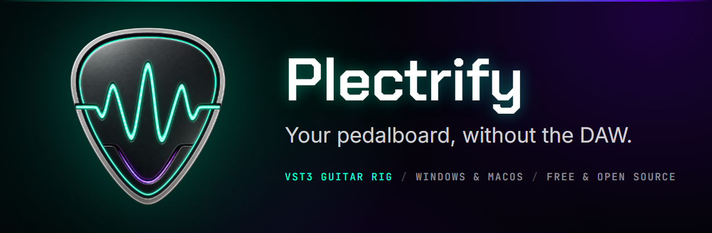
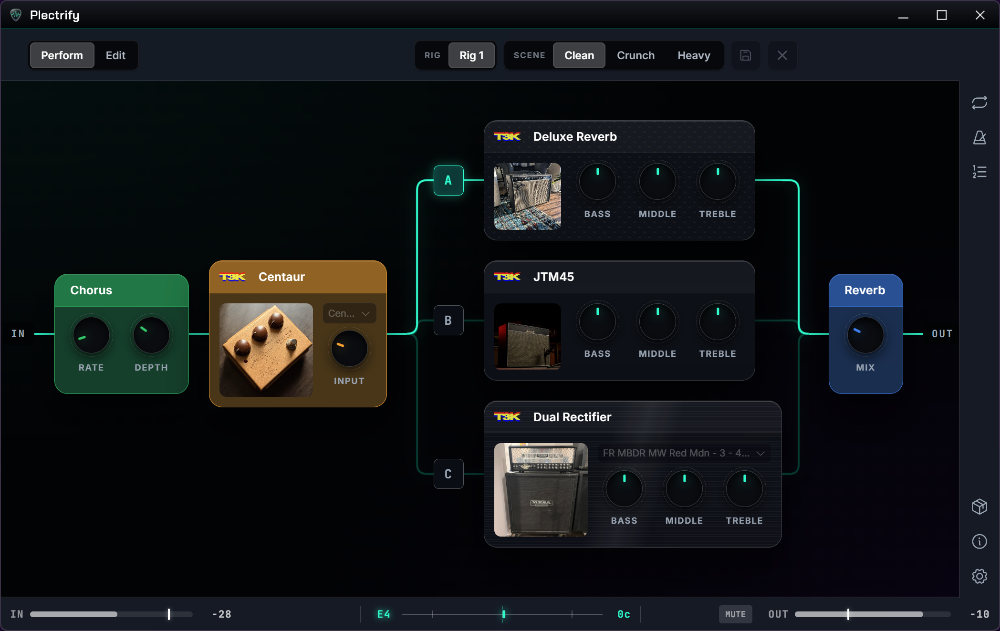

<div align="center">

<!-- The masthead is one rendered image rather than a stack of centred lines:
     icon, name and tagline are a single composition, set in the product's own
     type, and it is the composition that is centred. Built by
     Assets/SocialPreview.html at ?h=420 — the same source as the social card,
     so the page and the link unfurl cannot drift apart. -->



<!-- GitHub renders a lone image as a bare <a>, not wrapped in a <p>, so it
     carries no bottom margin and the buttons butt straight against the artwork.
     These <br>s are the gap. vspace on the img would be the tidier answer but
     the HTML sanitizer strips it, as it strips style. -->
<br>
<br>

<a href="https://github.com/patrickiel/plectrify/releases/latest"></a>
&nbsp;
<a href="https://github.com/patrickiel/plectrify/releases/latest"></a>

[Website](https://plectrify.com) ·
[Docs](https://plectrify.com/docs) ·
[Discord](https://discord.gg/dxQBanJr2X)

</div>

<!-- ───────────────────────────────────────────────────────────────────────────
     TODO: hero screenshot goes here.

     The one thing this page is still missing. A full-width shot of the rack —
     three or four modules, a mapped knob row, the status bar — does more than
     everything above it put together, because the product's whole claim is that
     it looks and works like a pedalboard.

     Save it as Assets/screenshot-rack.png (light) and, if the app's light theme
     is ever shot too, Assets/screenshot-rack-light.png, then delete this comment
     and uncomment the block below. The <picture> element is what keeps a dark
     screenshot from sitting in a white box for light-theme readers; with only
     one image, keep the plain  line and drop the two <source> lines.

     Full width and flush left, like everything else on this page — a centred
     hero would put the one centred element directly under a left-aligned
     masthead.

<picture>
  <source media="(prefers-color-scheme: light)" srcset="Assets/screenshot-rack-light.png">
  <source media="(prefers-color-scheme: dark)" srcset="Assets/screenshot-rack.png">
  
</picture>

──────────────────────────────────────────────────────────────────────────── -->

---

A free guitar rig for Windows and macOS. Plug in and play through your own
VST3 amp sims and pedals, chained like a real pedalboard.

Plectrify is a standalone app: no session to set up, no tracks to arm, no
recording to manage. Build a chain of amps and effects, tune up, and play.

```
GUITAR IN  →  [ drive ]  →  [ amp sim ]  →  [ reverb ]  →  OUT
```

Modules can be reordered, bypassed and swapped like pedals on a board, and the
whole thing runs live with the lowest latency your interface can do.

## What you get

<table>
<tr>
<td width="50%" valign="top">

**Your plugins, any order.** Runs your own VST3 amps and effects, from any
maker, in any chain you like. Mix a free overdrive into a commercial amp sim
into whatever reverb you love.

</td>
<td width="50%" valign="top">

**Thousands of real amp captures.** Browse the
[TONE3000](https://www.tone3000.com) library and load a capture of a real amp
right inside the app.

</td>
</tr>
<tr>
<td valign="top">

**Two amps at once.** Split the chain into parallel paths, each with its own
volume, pan, mute and solo, and merge them back.

</td>
<td valign="top">

**Only the controls you use.** A plugin's editor can be overwhelming — map the
few knobs you actually reach for onto the module card and hide the rest. Save
the layout as a patch and reuse it.

</td>
</tr>
<tr>
<td valign="top">

**Save and recall.** Save whole rigs — chain, routing, every plugin's exact
settings — and load them any time. Your last session restores on launch.

</td>
<td valign="top">

**Practice tools.** Tuner, metronome with tap tempo, and a looper, all built
in.

</td>
</tr>
<tr>
<td valign="top">

**Ready for the stage.** Put songs in a setlist and each one loads its rig.
Scenes, MIDI learn and a stage view let you run the set from a footswitch.

</td>
<td valign="top">

**Yours, with nothing attached.** Free and open source. No account, no DRM, no
iLok, no telemetry — the only thing it ever phones home for is an anonymous
update check.

</td>
</tr>
</table>

## Install

Grab the latest installer from the
[releases page](https://github.com/patrickiel/plectrify/releases):

- **Windows 10/11 (64-bit):** run `Plectrify-<version>-win-x64-setup.exe`.
  Everything it needs is bundled.
- **macOS (Apple Silicon, 13.3+):** open `Plectrify-<version>-macos-arm64.dmg`
  and drag the app to Applications.

> [!IMPORTANT]
> The macOS build is signed but **not notarized**, so macOS blocks the first
> launch and may claim the app *"is damaged"* — it isn't. Go to
> **System Settings → Privacy & Security → Open Anyway**, or see the
> [full instructions](https://plectrify.com/docs/opening-on-macos). Every DMG
> ships with a SHA-256 checksum you can verify.

Bring your own VST3 plugins — plenty of great amp sims and effects are free.
One thing is included out of the box: [Neural Amp Modeler](https://www.neuralampmodeler.com),
so TONE3000 captures play with nothing else installed. On Windows, install your
audio interface's ASIO driver for the lowest latency; on macOS, CoreAudio
already is the low-latency driver.

## First five minutes

1. Open **Audio Settings** and pick your interface — the ASIO device type on
   Windows — as input, and your speakers or headphones as output. The first
   enabled input channel is your guitar.
2. Hit **Scan Plugins** once. Plectrify finds the VST3s on your system and
   remembers them.
3. Add modules to the rack: an amp sim, then whatever effects you like. Drag
   to reorder, click to bypass, open a plugin's own editor from its card.
4. Map the knobs you care about, save the rig, play.

The [docs](https://plectrify.com/docs) walk through all of it in more detail.

## Feedback and bugs

Found a problem or want something added? Open an
[issue](https://github.com/patrickiel/plectrify/issues) or come say hi on
[Discord](https://discord.gg/dxQBanJr2X).

For bugs, the fastest route is inside the app: **About & feedback** builds a
full environment report (build, machine, audio device, plugin chain — never
your rig names or file paths), and **Report a bug** opens GitHub's bug form
with it already filled in.

## For developers

Plectrify is a JUCE 8 (C++17) app hosting VST3s, with the entire UI a Svelte 5
web app in an embedded web view. If you want to build it from source or
contribute:

- [CONTRIBUTING.md](CONTRIBUTING.md) — build, run and test from source
- [AGENTS.md](AGENTS.md) — architecture and repository layout in depth
- [RELEASING.md](RELEASING.md) — how installers are built and published
- [SECURITY.md](SECURITY.md) — what to report privately, and where

## Licence

Plectrify is free software under the
[GNU Affero General Public License, version 3](LICENSE). Installers include
the complete licence and are accompanied by a checksummed source archive of
the exact Plectrify and patched JUCE code used for the build.
