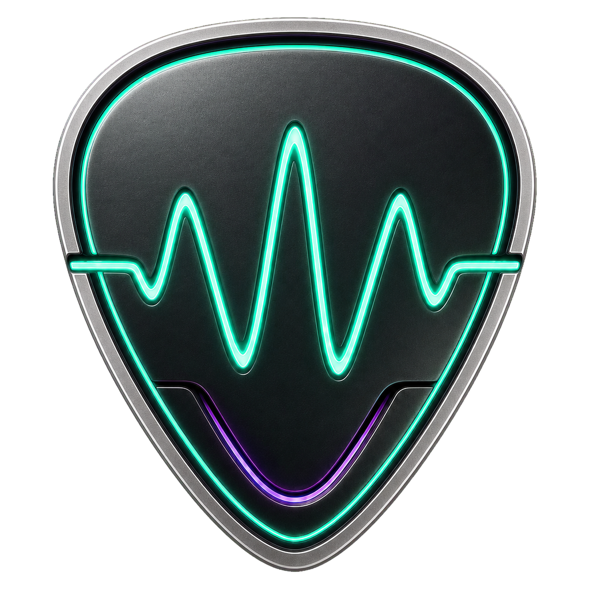

<div align="center">



# Plectrify

**Your pedalboard, without the DAW.**

A free guitar rig for Windows and macOS. Plug in and play through your own
VST3 amp sims and pedals, chained like a real pedalboard.

[**Download**](https://github.com/patrickiel/plectrify/releases) ·
[Website](https://plectrify.com) ·
[Docs](https://plectrify.com/docs) ·
[Discord](https://discord.gg/dxQBanJr2X)

</div>

---

Plectrify is a standalone app: no session to set up, no tracks to arm, no
recording to manage. Build a chain of amps and effects, tune up, and play.

```
GUITAR IN  →  [ drive ]  →  [ amp sim ]  →  [ reverb ]  →  OUT
```

Modules can be reordered, bypassed and swapped like pedals on a board, and the
whole thing runs live with the lowest latency your interface can do.

## What you get

- **Your plugins, any order.** Runs your own VST3 amps and effects, from any
  maker, in any chain you like. Mix a free overdrive into a commercial amp sim
  into whatever reverb you love.
- **Thousands of real amp captures.** Browse the [TONE3000](https://www.tone3000.com)
  library and load a capture of a real amp right inside the app.
- **Two amps at once.** Split the chain into parallel paths, each with its own
  volume, pan, mute and solo, and merge them back.
- **Only the controls you use.** A plugin's editor can be overwhelming — map
  the few knobs you actually reach for onto the module card and hide the rest.
  Save the layout as a patch and reuse it.
- **Save and recall.** Save whole rigs — chain, routing, every plugin's exact
  settings — and load them any time. Your last session restores on launch.
- **Practice tools.** Tuner, metronome with tap tempo, and a looper, all built
  in.
- **Ready for the stage.** Put songs in a setlist and each one loads its rig.
  Scenes, MIDI learn and a stage view let you run the set from a footswitch.

Plectrify is free and open source. No account, no DRM, no iLok, no telemetry —
the only thing it ever phones home for is an anonymous update check.

## Install

Grab the latest installer from the
[releases page](https://github.com/patrickiel/plectrify/releases):

- **Windows 10/11 (64-bit):** run `Plectrify-<version>-win-x64-setup.exe`.
  Everything it needs is bundled.
- **macOS (Apple Silicon, 13.3+):** open `Plectrify-<version>-macos-arm64.dmg`
  and drag the app to Applications. The build is signed but not notarized, so
  macOS blocks the first launch and may claim the app "is damaged" — it isn't.
  Go to **System Settings → Privacy & Security → Open Anyway**, or see the
  [full instructions](https://plectrify.com/docs/opening-on-macos). Every DMG
  ships with a SHA-256 checksum you can verify.

Bring your own VST3 plugins — plenty of great amp sims and effects are free.
One thing is included out of the box: [Neural Amp Modeler](https://www.neuralampmodeler.com),
so TONE3000 captures play with nothing else installed. On Windows, install your
audio interface's ASIO driver for the lowest latency; on macOS, CoreAudio
already is the low-latency driver.

## First five minutes

1. Open **Audio Settings** and pick your interface — the ASIO device type on
   Windows — as input, and your speakers or headphones as output. The first
   enabled input channel is your guitar.
2. Hit **Scan Plugins** once. Plectrify finds the VST3s on your system and
   remembers them.
3. Add modules to the rack: an amp sim, then whatever effects you like. Drag
   to reorder, click to bypass, open a plugin's own editor from its card.
4. Map the knobs you care about, save the rig, play.

The [docs](https://plectrify.com/docs) walk through all of it in more detail.

## Feedback and bugs

Found a problem or want something added? Open an
[issue](https://github.com/patrickiel/plectrify/issues) or come say hi on
[Discord](https://discord.gg/dxQBanJr2X).

For bugs, the fastest route is inside the app: **About & feedback** builds a
full environment report (build, machine, audio device, plugin chain — never
your rig names or file paths), and **Report a bug** opens GitHub's bug form
with it already filled in.

## For developers

Plectrify is a JUCE 8 (C++17) app hosting VST3s, with the entire UI a Svelte 5
web app in an embedded web view. If you want to build it from source or
contribute:

- [CONTRIBUTING.md](CONTRIBUTING.md) — build, run and test from source
- [AGENTS.md](AGENTS.md) — architecture and repository layout in depth
- [RELEASING.md](RELEASING.md) — how installers are built and published

## Licence

Plectrify is free software under the
[GNU Affero General Public License, version 3](LICENSE). Installers include
the complete licence and are accompanied by a checksummed source archive of
the exact Plectrify and patched JUCE code used for the build.
